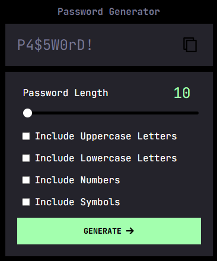

# Password Generator

## Description

I was given the task of writing JavaScript code to produce an application that generates a random password using paramaters/options provided by the user

Application functionality requirements:
- Generate a password when the button is clicked
  - Present a form for password criteria
    - Length of password
      - At least 10 characters but no more than 64
    - Character types
      - Lowercase
      - Uppercase
      - Numeric
      - Special characters ($@%&*, etc)
  - Code should validate for each input and at least one character type should be selected
  - If input passes validation then the password should be generated and written to the page

The application will be completed when all of the above criteria are met and a random password is written to the page.

## Table of contents
- [Installation](#installation)
- [Usage](#usage)
- [Credits](#credits)
- [License](#license)

## Installation
N/A

## Usage
- [Deployed Application](https://trunten.github.io/fm-password-generator/)
- JavaScript is required for the site to function (make sure it is enabled).
    - noscript tag included to alert the user that JavaScript is required.
- Generated password can be copied to the clipboard by clicking the "Copy" button.
- Preview of the output:

## Credits
N/A

## License
Please refer to the [LICENSE (MIT)](LICENSE) in the repo.
